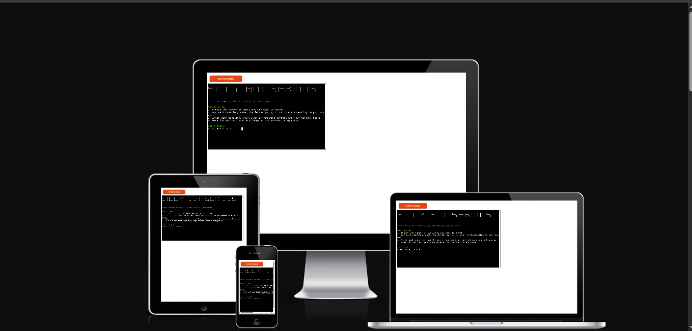
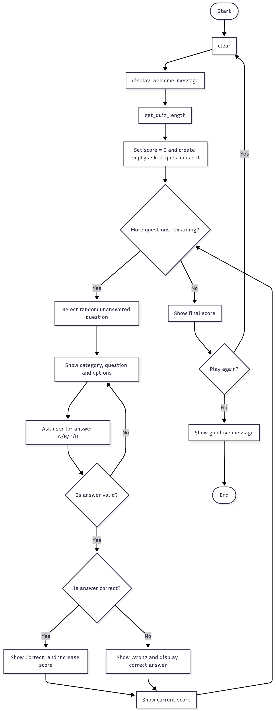
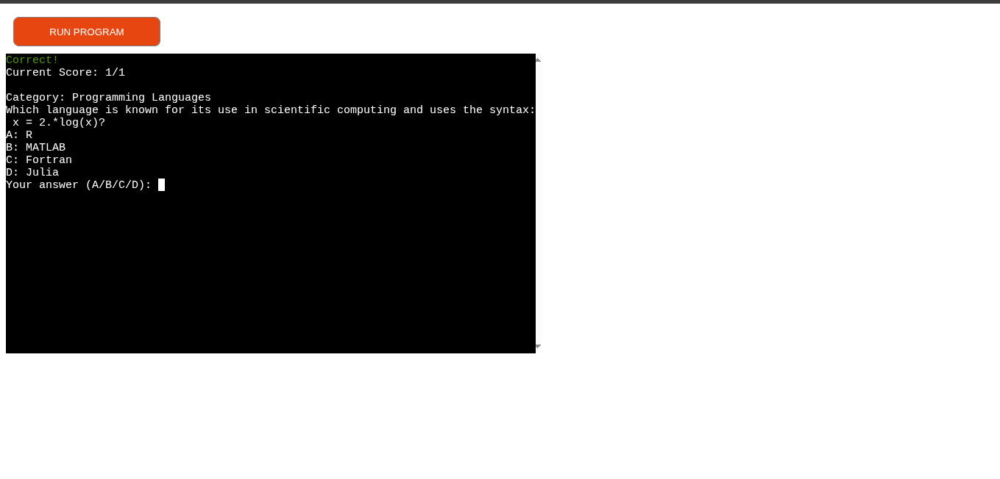
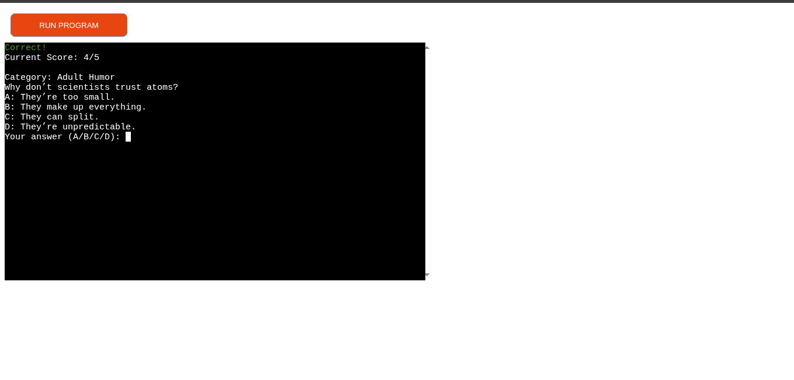
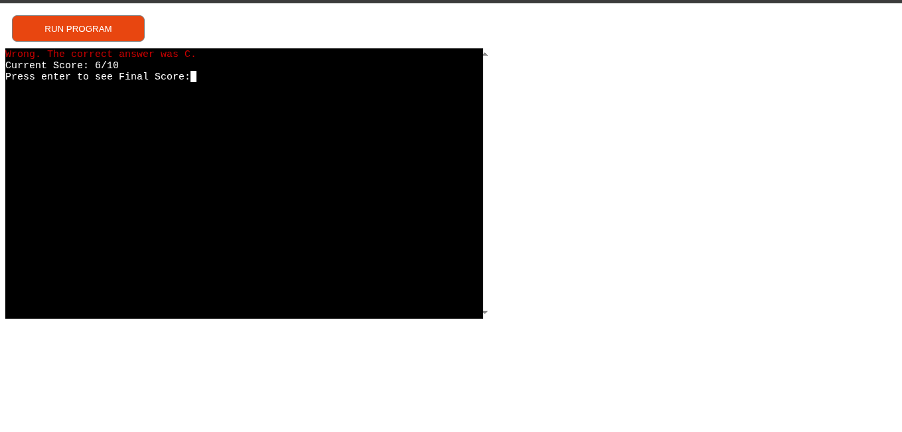
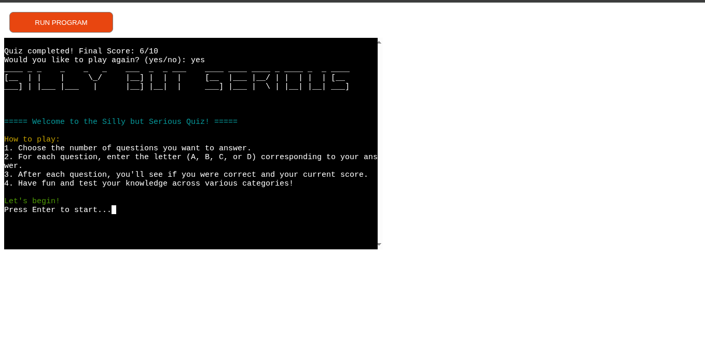
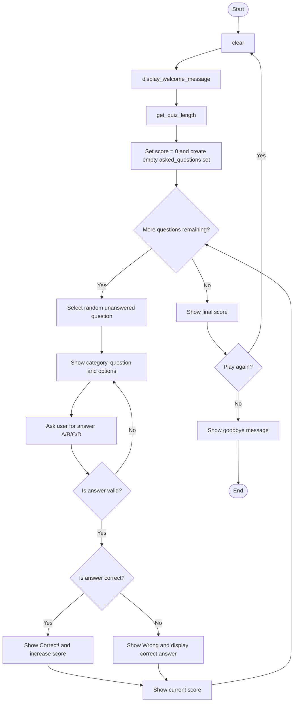

# [SillyButSerious](https://silly-but-serious-ff8c9d0224be.herokuapp.com)

Developer: Kristian Cross ([KC-85](https://www.github.com/KC-85))

[](https://www.github.com/KC-85/SillyButSerious/commits/main)
[](https://www.github.com/KC-85/SillyButSerious/commits/main)
[](https://www.github.com/KC-85/SillyButSerious)
[](https://silly-but-serious-ff8c9d0224be.herokuapp.com)

**SillyButSerious** is a terminal-based quiz game designed to mix genuine knowledge testing with light-hearted fun. Users answer a collection of multiple-choice questions that include both “serious” factual topics and intentionally silly, humorous categories. The goal is to create an accessible, entertaining, and highly replayable quiz experience.

**Site Mockups**



source: [SillyButSerious amiresponsive](https://ui.dev/amiresponsive?url=https://silly-but-serious-ff8c9d0224be.herokuapp.com)

> [!IMPORTANT]  
> The examples in these templates are strongly influenced by the Code Institute walkthrough project called "Love Sandwiches".

## UX

### The 5 Planes of UX

#### 1. Strategy

**Purpose**
- Create an engaging quiz combining factual and humorous content.
- Offer users a lightweight, enjoyable interactive experience.
- Demonstrate Python logic, input handling, validation, loops, and modular design.

**Primary User Needs**
- Clear instructions.
- Easy-to-read multiple-choice questions.
- A mix of serious and silly categories.
- Accurate scoring.
- Smooth and error-resistant input handling.
- The ability to choose quiz length.

**Business/Learning Goals**
- Build a polished terminal app showcasing Python fundamentals.
- Provide replayability through randomised questions and humour.
- Demonstrate clean structure, modular programming, and defensive input validation.

#### 2. Scope

**[Features](#features)** (see below)

**Content Requirements**
- Questions stored in `questions.py`.
- Categories: Silly, Serious.
- Each question object contains:
  - question text  
  - four options (A–D)  
  - correct answer  
  - category

#### 3. Structure

**Information Architecture**
- **Hierarchy**:
  - **Welcome Screen:** ASCII banner + instructions  
  - **Quiz Setup:** Select number of questions  
  - **Quiz Loop:**  
  - Random question  
  - Display category + question + options  
  - Validate A/B/C/D input  
  - Give feedback  
  - Update score  
  - **Completion:** Show final score  
  - **Replay:** Option to restart or exit 

**User Flow**
- User starts quiz  
- User selects quiz length  
- Quiz presents unique randomised questions  
- User answers with A/B/C/D  
- Quiz validates input  
- Score updates  
- After final question → final score  
- User may play again

#### 4. Skeleton

**[Wireframes](#wireframes)** (see below)

#### 5. Surface

**Visual Design Elements**
- **[Colours](#colour-scheme)** (see below)
- **[Typography](#typography)** (see below)

## Wireframes

To follow best practice, a flowchart was created to showcase the progression of the Python app.
I've used [Mermaid](https://www.lucidchart.com/pages/examples/flowchart-maker) to design my app flowchart.



## User Stories

⚠️ INSTRUCTIONS ⚠️

In this section, list all of your possible user stories for the project. Samples have been provided below using the example walkthrough project for your inspiration. Make sure to adjust to match your own project features!

⚠️ --- END --- ⚠️

| Target | Expectation | Outcome |
| --- | --- | --- |
| As a user | I want clear instructions | so I understand how to play. |
| As a user | I want to choose my quiz length | so I can play a short or long quiz. |
| As a user | I want serious and silly categories | so the experience stays fun and unpredictable. |
| As a user | I want to answer A/B/C/D quickly | so gameplay stays fast and simple. |
| As a user | I want validation for my input | so I don’t break the quiz accidentally. |
| As a user | I want feedback after answering | so I know whether I was correct. |
| As a user | I want to track my score | so I can see how well I’m doing. |
| As a user | I want no repeated questions | so the quiz feels fresh. |
| As a user | I want a replay option | so I can try again. |
| As a user | I want readable and visually appealing output | so the quiz feels polished. |

## Features

⚠️ INSTRUCTIONS ⚠️

In this section, you should go over the different parts of your project, and describe each feature. You should explain what value each of the features provides for the user, focusing on your target audience, what they want to achieve, and how your project can help them achieve these things.

**IMPORTANT**: Remember to always include a screenshot of each individual feature!

⚠️ --- END --- ⚠️

### Existing Features

| Feature | Notes | Screenshot |
| --- | --- | --- |
| ASCII Welcome Screen | Pyfiglet banner + intro text. |  |
| Quiz Length Menu | User chooses 10–100 questions. |  |
| Mixed Categories | Each question displays “Serious” or “Silly.” |   |
| A/B/C/D Input Validation | Rejects invalid answers. |  |
| Correct/Wrong Feedback | “Correct!” or correct-answer display. |  |
| Score Tracking | Score displayed after each question. |  |
| Final Score Summary | Clean summary after quiz ends. |  |
| Replay Quiz Option | Play again loop. |  |
| Terminal Clearing | Keeps interface clean. |  |


### Future Features

- Leaderboard saved to JSON or Google Sheet  
- Filter categories (Serious / Silly / Mixed)  
- Timed question mode  
- Difficulty levels  
- User-generated custom questions  
- Themes (e.g., “Chaos Mode,” “Scholar Mode”)  
- Multiplayer hot-seat  
- Achievements / badges

## Tools & Technologies

| Tool / Tech | Use |
| --- | --- |
| [](https://markdown.2bn.dev) | Generate README and TESTING templates. |
| [](https://git-scm.com) | Version control. (`git add`, `git commit`, `git push`) |
| [](https://github.com) | Secure online code storage. |
| [](https://code.visualstudio.com) | Local IDE for development. |
| [](https://www.python.org) | Back-end programming language. |
| [](https://www.heroku.com) | Hosting the deployed back-end site. |
| [](https://chat.openai.com) | Help debug, troubleshoot, and explain things. |
| [](https://www.lucidchart.com) | Flow diagrams for mapping the app's logic. |
| [](https://stackoverflow.com) | Troubleshooting and Debugging |

## Database Design

### Data Model

#### Flowchart

To follow best practice, a flowchart was created for the app's logic, and mapped out using a free version of [Mermaid](https://www.mermaidchart.com) and/or [Draw.io](https://www.draw.io). The flowchart below represents the main process of this Python program. It shows the entire cycle of the application.




#### Classes & Functions

The program uses classes as a blueprint for the project's object-oriented programming (OOP). This allows for the object to be reusable and callable where necessary.

This project is built using a functional approach. No custom Python classes are required for the current scope of the quiz.

The main functions are:

- `clear()`
  - Clears the terminal screen using `os.system("cls" if os.name == "nt" else "clear")`.
  - Keeps the interface tidy and easy to read between stages of the quiz.

- `display_welcome_message()`
  - Renders the ASCII “Silly but Serious” title using **pyfiglet**.
  - Prints the quiz instructions (how to play, how to answer).
  - Waits for the user to press Enter before starting.
  - Calls `clear()` once the user is ready to begin.

- `get_quiz_length()`
  - Displays a menu for the user to choose how many questions to answer.
  - Uses the predefined `QUIZ_LENGTHS = [10, 20, 50, 100]`.
  - Validates input so only numeric choices 1–4 are accepted.
  - Returns the selected quiz length as an integer.

- `play_again()`
  - Asks the user if they want to play again (`yes/no`).
  - Accepts `yes`, `y`, `no`, `n` (case-insensitive).
  - Keeps prompting until a valid response is entered.
  - Returns `True` for yes and `False` for no.

- `run_quiz()`
  - Core game loop for the quiz.
  - Calls `display_welcome_message()` and `get_quiz_length()`.
  - Sets `score = 0` and creates an empty `asked_questions` set.
  - While there are still questions to ask:
    - Selects a random question index from `QUESTIONS` that has not been used before.
    - Displays the question’s category, question text, and multiple-choice options (A–D).
    - Validates that the user’s answer is one of `A`, `B`, `C`, or `D` (case-insensitive).
    - Checks if the answer matches `correct_answer` from the question data.
    - Shows “Correct!” in green and increments the score, or shows the correct answer in red if wrong.
    - Displays the current score as `score / questions_answered`.
  - After all questions are answered:
    - Pauses for Enter, then clears the screen.
    - Displays the final score.
    - Calls `play_again()` to decide whether to restart the quiz or exit.

- `wait_for_enter()`
  - Displays a final prompt asking the user to press Enter to exit the program.
  - Used after `run_quiz()` completes to close gracefully.

The question data is stored externally in `questions.py` as a list of dictionaries.  
Each question follows this structure:

```python
QUESTIONS = [
    {
        "question": "Example question text?",
        "options": {
            "A": "Option A",
            "B": "Option B",
            "C": "Option C",
            "D": "Option D"
        },
        "correct_answer": "A",
        "category": "Serious"  # or "Silly"
    },
    # More questions...
]
```

#### Imports

I've used the following Python packages and external imports.

- `pyfiglet`: used to generate large ASCII-art text, allowing the quiz title to be displayed in a stylised, eye-catching format.
- `termcolor`: used to add coloured text in the terminal, improving readability and making feedback such as correct or incorrect answers more visually clear.

## Testing

> [!NOTE]  
> For all testing, please refer to the [TESTING.md](TESTING.md) file.

## Deployment

Code Institute has provided a [template](https://github.com/Code-Institute-Org/python-essentials-template) to display the terminal view of this backend application in a modern web browser. This is to improve the accessibility of the project to others.

The live deployed application can be found deployed on [Heroku](https://silly-but-serious-ff8c9d0224be.herokuapp.com).

### Heroku Deployment

This project uses [Heroku](https://www.heroku.com), a platform as a service (PaaS) that enables developers to build, run, and operate applications entirely in the cloud.

Deployment steps are as follows, after account setup:

- Select **New** in the top-right corner of your Heroku Dashboard, and select **Create new app** from the dropdown menu.
- Your app name must be unique, and then choose a region closest to you (EU or USA), then finally, click **Create App**.
- From the new app **Settings**, click **Reveal Config Vars**, and set the value of **KEY** to `PORT`, and the **VALUE** to `8000` then select **ADD**.
- If using any confidential credentials, such as **CREDS.JSON**, then these should be pasted in the Config Variables as well.
- Further down, to support dependencies, select **Add Buildpack**.
- The order of the buildpacks is important; select `Python` first, then `Node.js` second. (if they are not in this order, you can drag them to rearrange them)

Heroku needs some additional files in order to deploy properly.

- [requirements.txt](requirements.txt)
- [Procfile](Procfile)
- [.python-version](.python-version)

You can install this project's **[requirements.txt](requirements.txt)** (*where applicable*) using:

- `pip3 install -r requirements.txt`

If you have your own packages that have been installed, then the requirements file needs updated using:

- `pip3 freeze --local > requirements.txt`

The **[Procfile](Procfile)** can be created with the following command:

- `echo web: node index.js > Procfile`

The **[.python-version](.python-version)** file tells Heroku the specific version of Python to use when running your application.

- `3.12` (or similar)

For Heroku deployment, follow these steps to connect your own GitHub repository to the newly created app:

Either (*recommended*):

- Select **Automatic Deployment** from the Heroku app.

Or:

- In the Terminal/CLI, connect to Heroku using this command: `heroku login -i`
- Set the remote for Heroku: `heroku git:remote -a app_name` (*replace `app_name` with your app name*)
- After performing the standard Git `add`, `commit`, and `push` to GitHub, you can now type:
	- `git push heroku main`

The Python terminal window should now be connected and deployed to Heroku!


### Local Development

This project can be cloned or forked in order to make a local copy on your own system.

For either method, you will need to install any applicable packages found within the [requirements.txt](requirements.txt) file.

- `pip3 install -r requirements.txt`.

If using any confidential credentials, such as `CREDS.json` or `env.py` data, these will need to be manually added to your own newly created project as well.

#### Cloning

You can clone the repository by following these steps:

1. Go to the [GitHub repository](https://www.github.com/KC-85/SillyButSerious).
2. Locate and click on the green "Code" button at the very top, above the commits and files.
3. Select whether you prefer to clone using "HTTPS", "SSH", or "GitHub CLI", and click the "copy" button to copy the URL to your clipboard.
4. Open "Git Bash" or "Terminal".
5. Change the current working directory to the location where you want the cloned directory.
6. In your IDE Terminal, type the following command to clone the repository:
	- `git clone https://www.github.com/KC-85/SillyButSerious.git`
7. Press "Enter" to create your local clone.

Alternatively, if using Ona (formerly Gitpod), you can click below to create your own workspace using this repository.

[](https://gitpod.io/#https://www.github.com/KC-85/SillyButSerious)

**Please Note**: in order to directly open the project in Ona (Gitpod), you should have the browser extension installed. A tutorial on how to do that can be found [here](https://www.gitpod.io/docs/configure/user-settings/browser-extension).

#### Forking

By forking the GitHub Repository, you make a copy of the original repository on our GitHub account to view and/or make changes without affecting the original owner's repository. You can fork this repository by using the following steps:

1. Log in to GitHub and locate the [GitHub Repository](https://www.github.com/KC-85/SillyButSerious).
2. At the top of the Repository, just below the "Settings" button on the menu, locate and click the "Fork" Button.
3. Once clicked, you should now have a copy of the original repository in your own GitHub account!

### Local VS Deployment

There are no remaining major differences between the local version when compared to the deployed version online.

## Credits

### Content

| Source | Notes |
| --- | --- |
| [Markdown Builder](https://markdown.2bn.dev) | Help generating Markdown files |
| [Chris Beams](https://chris.beams.io/posts/git-commit) | "How to Write a Git Commit Message" |
| [Love Sandwiches](https://codeinstitute.net) | Code Institute walkthrough project inspiration |
| [Real Python](https://realpython.com/python-quiz-application) | Inspiration for a quiz app |
| [BroCode](https://www.youtube.com/watch?v=ag8NtD1e0Kc) | Inspiration for hangman game |
| [Python Tutor](https://pythontutor.com) | Additional Python help |
| [Colorama](https://www.youtube.com/watch?v=u51Zjlnui4Y) | Adding color in Python |
| [StackOverflow](https://stackoverflow.com/a/50921841) | Clear screen in Python |
| [ChatGPT](https://chatgpt.com) | Help with code logic and explanations |

### Media

| Source | Notes |
| --- | --- |
| [ASCII Art Archive](https://www.asciiart.eu) | Pre-defined ASCII art |
| [TEXT-IMAGE](https://www.text-image.com) | Converting an image to ASCII art |
| [Patorjk](https://patorjk.com/software/taag) | Converting text to ASCII art |

### Acknowledgements

- I would like to thank my Code Institute mentor, [Tim Nelson](https://www.github.com/TravelTimN) for the support throughout the development of this project.
- I would like to thank the [Code Institute](https://codeinstitute.net) Tutor Team for their assistance with troubleshooting and debugging some project issues.
- I would like to thank the [Code Institute Slack community](https://code-institute-room.slack.com) and [Code Institute Discord community](https://discord-portal.codeinstitute.net) for the moral support; it kept me going during periods of self doubt and impostor syndrome.
- I would like to thank my partner, for believing in me, and allowing me to make this transition into software development.
- I would like to thank my employer, for supporting me in my career development change towards becoming a software developer.
