# Testing

> [!NOTE]  
> Return back to the [README.md](README.md) file.

## Code Validation

### Python

I have used the recommended [PEP8 CI Python Linter](https://pep8ci.herokuapp.com) to validate all of my Python files.

| Directory | File | URL | Screenshot | Notes |
| --- | --- | --- | --- | --- |
|  | [questions.py](https://github.com/KC-85/SillyButSerious/blob/main/questions.py) | [PEP8 CI Link](https://pep8ci.herokuapp.com/https://raw.githubusercontent.com/KC-85/SillyButSerious/main/questions.py) | 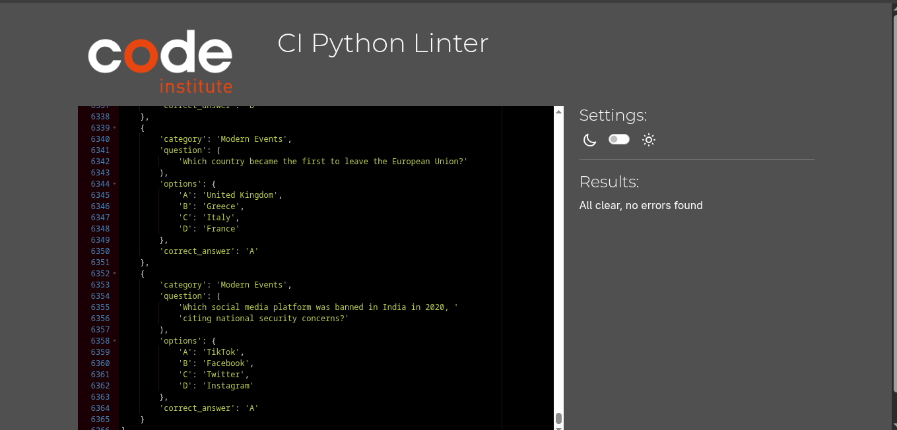 | N/A |
|  | [run.py](https://github.com/KC-85/SillyButSerious/blob/main/run.py) | [PEP8 CI Link](https://pep8ci.herokuapp.com/https://raw.githubusercontent.com/KC-85/SillyButSerious/main/run.py) | 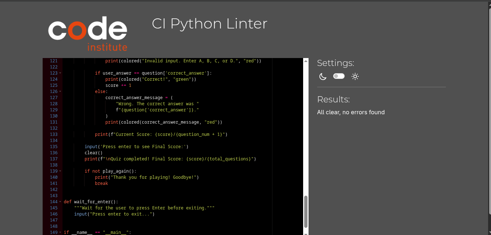 | N/A |

## User Story Testing

| Target | Expectation | Outcome | Screenshot |
| --- | --- | --- | --- |
| As a user, I want clear instructions | so I immediately understand how to play. | The welcome screen explains how to choose quiz length, how to answer questions, and how scoring works. | 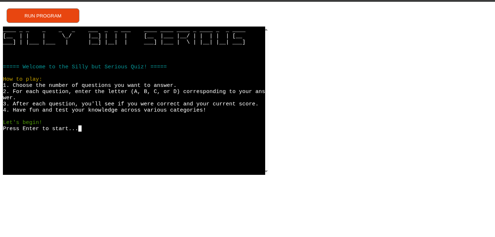 |
| As a user, I want to choose the quiz length | so I can play a short or long quiz depending on my time. | Quiz length menu offers 10, 20, 50 or 100 questions, with validated input. | 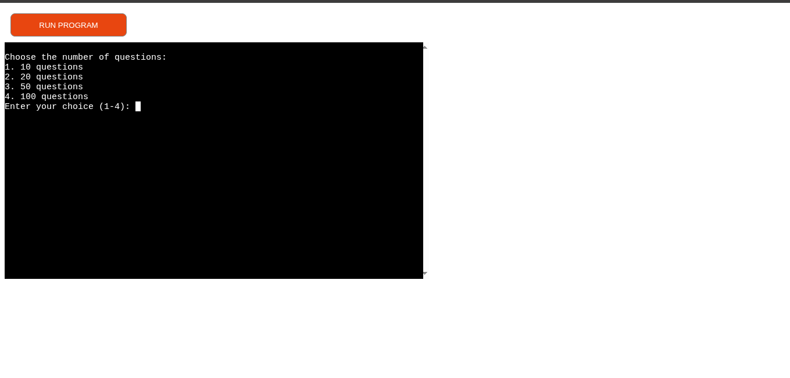 |
| As a user, I want both serious and silly questions | so that the quiz feels fun and unpredictable. | Questions are grouped into categories, displayed at the top of each question (e.g., “Serious” or “Silly”). |  |
| As a user, I want multiple-choice answers | so I can answer quickly without typing full words. | Each question displays options A–D clearly underneath the question. | 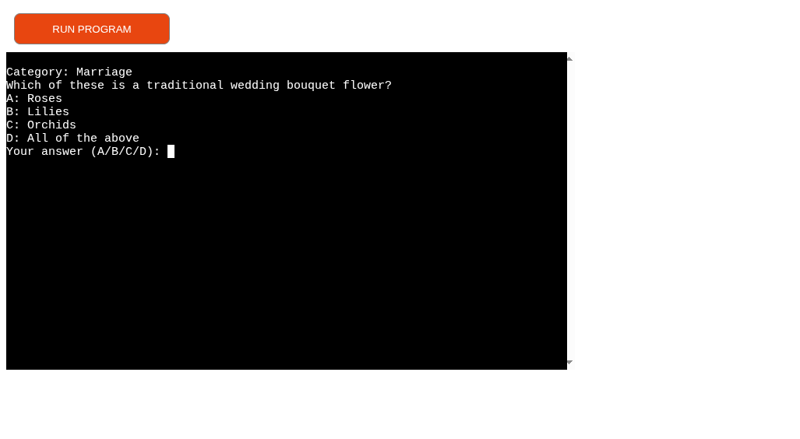 |
| As a user, I want answer validation | so I don’t accidentally break the game with incorrect input. | Invalid input such as numbers, words or blank responses are rejected with a message and re-prompt. | 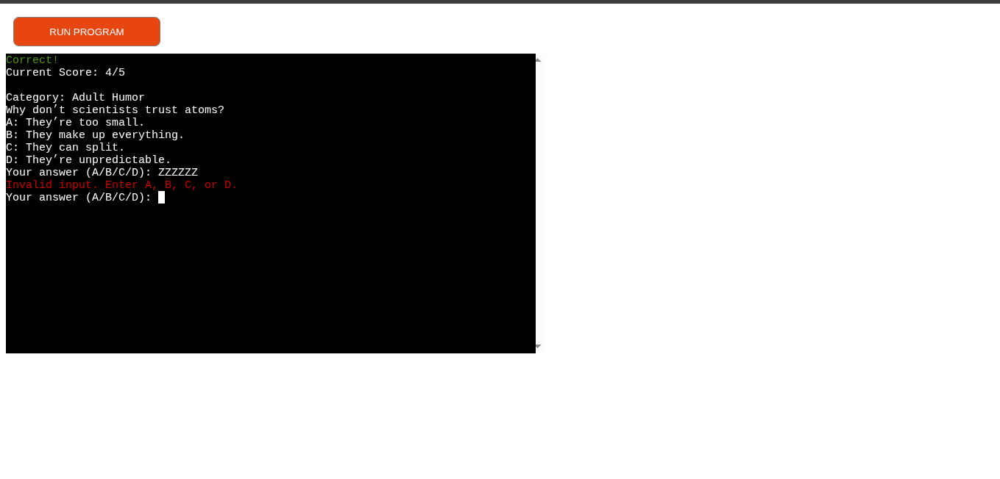 |
| As a user, I want feedback after each question | so I know whether I got it right or wrong. | The quiz prints “Correct!” in green or a red message explaining the correct answer. | 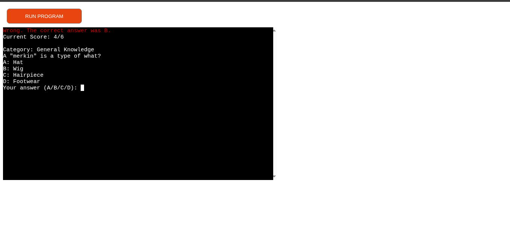 |
| As a user, I want to track my score | so I can see how well I’m doing during the quiz. | After each question, the current score is shown as `score/questions_answered`. | 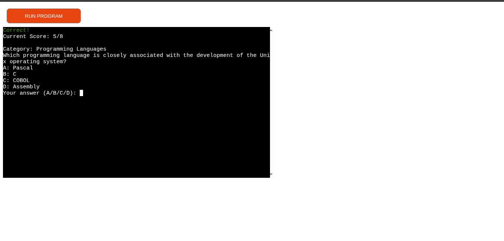 ||
| As a user, I want the option to replay | so I can try to improve my score. | After the final score, the user is asked if they want to play again; if yes, the quiz restarts. | 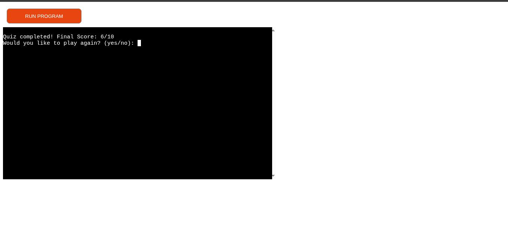 |
| As a user, I want the interface to be readable and engaging | so it doesn’t feel like a plain text dump. | ASCII art and coloured text (via `pyfiglet` and `termcolor`) are used for key sections. | 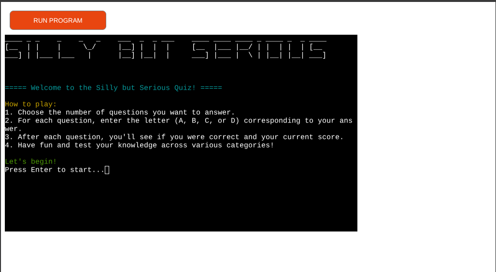 |

## Bugs

- There are no known bugs i am aware of during this resubmission.

### Fixed Bugs

### Known Issues

| Issue | Screenshot |
| --- | --- |
| The project is designed to be responsive from `375px` and upwards, in line with the material taught on the course LMS. Minor layout inconsistencies may occur on extra-wide (e.g. 4k/8k monitors), or smart-display devices (e.g. Nest Hub, Smart Watches, Gameboy Color, etc.), as these resolutions are outside the project’s scope, as taught by Code Institute. | 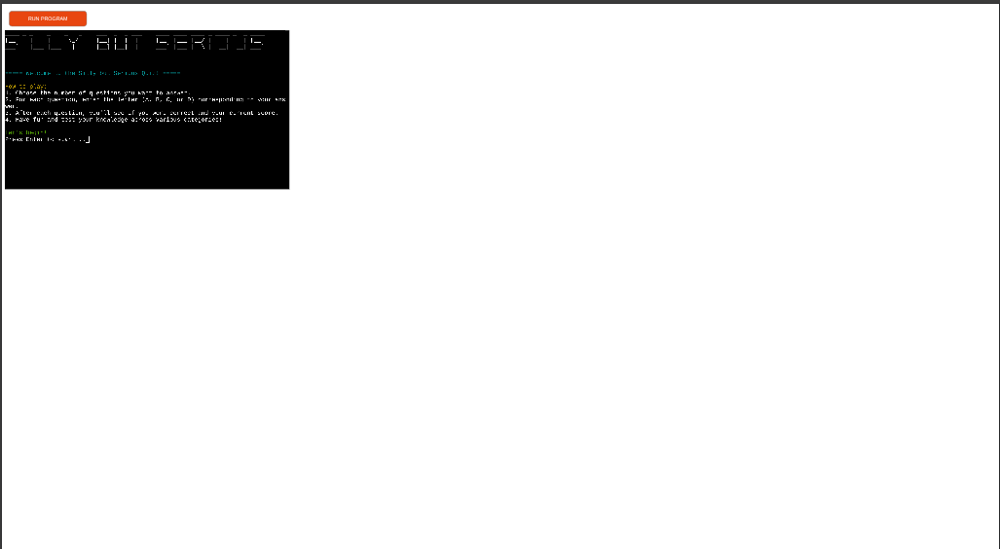 |
| The `termcolor` terminal colors are fainter on Heroku when compared to the IDE locally. |  |
| If a user types `CTRL`+`C` in the terminal on the live site, they can manually stop the application and receive and error. | 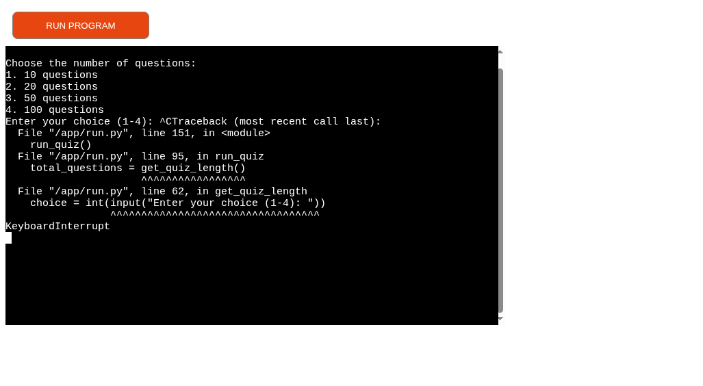 |

> [!IMPORTANT]  
> There are no remaining bugs that I am aware of, though, even after thorough testing, I cannot rule out the possibility.

